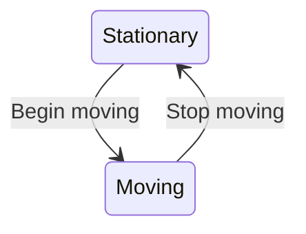

# LCFila
Queue Managment

<!-- This content will not appear in the rendered Markdown 
:+1:

## Simple alerts
> [!NOTE]
> This is a note.

> [!TIP]
> This is a tip. (Supported since 14 Nov 2023)

> [!IMPORTANT]
> Crutial information comes here.

> [!CAUTION]
> Negative potential consequences of an action. (Supported since 14 Nov 2023)

> [!WARNING]
> Critical content comes here.

| ⚠️ Warning                               | 
|------------------------------------------|
| You shouldn't. This is irreversible!     |

| ❌ Error                                 | 
|------------------------------------------|
| Don't do that. This is irreversible!     |

| ℹ️ Information                           | 
|------------------------------------------|
| You can do that without problem.         |

| ✅ Success                               | 
|------------------------------------------|
| Don't hesitate to do that.               |

| 🦄 New line support                       | 
|-------------------------------------------|
| It supports new lines: .. simply use ` ` for new lines|

> **⚠️ Warning**
>
> You shouldn't. This is irreversible!

> **❌ Error**
>
> Don't do that. This is irreversible!

> **ℹ️ Information**
>
> You can do that without problem.

> **✅ Success**
>
> Don't hesitate to do that.

> **🦄 New line support**
> 
> It supports new lines:
>
> .. simply use an empty `>` line
>
-->

<!-- 
- [x] #739
- [ ] https://github.com/octo-org/octo-repo/issues/740
- [ ] Add delight to the experience when all tasks are complete :tada:
- [ ] \(Optional) Open a followup issue

Here is a simple footnote[^1].

A footnote can also have multiple lines[^2].

[^1]: My reference.
[^2]: To add line breaks within a footnote, prefix new lines with 2 spaces.
  This is a second line.

-->
