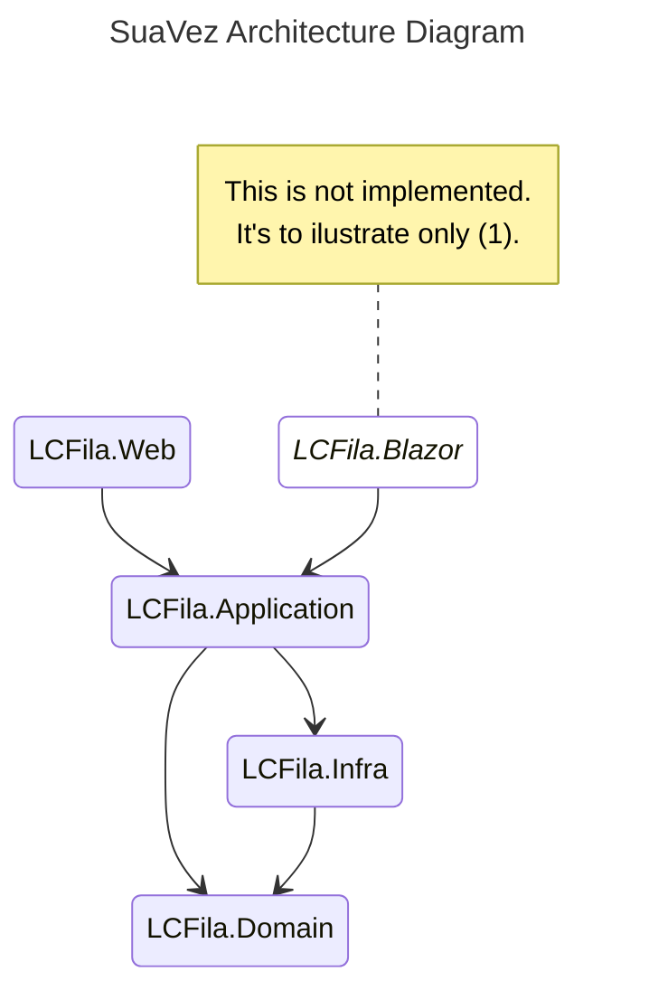

# SuaVez - Queue Managment

**SuaVez** is a robust **Queue Management System** designed for fast-food chains, restaurants, and multi-company environments. It provides advanced queue control, priority management, and customization options to enhance operational efficiency and customer satisfaction. 

This project was initially developed as a monolithic ASP.NET Core 3.1 application with Identity Pages integrated as Razor, and later refactored into a layered architecture with Identity moved to an MVC structure.

> [!CAUTION]
> This project was originally developed from an abandoned client project. It will be over-engineered with a lot of unnecessary complexity and features, and is not recommended for use in a production or product environment. While it has been adapted for inclusion in a portfolio, it may not follow best practices for scalability, performance, or maintainability. If you're considering using it, please review the code thoroughly and make the necessary adjustments before deploying to production.

## Table of Contents

- [Key Features](#key-features)
- [Architecture Overview](#architecture-overview)
- [Getting Started](#getting-started)
- [Usage](#usage)
- [Planned Features](#planned-features)
- [Architecture Decision Records (ADRs)](#architecture-decision-records-adrs)
- [Contributing](#contributing)
- [License](#license)
- [Contact](#contact)


## Key Features

### Core Queue Management
- **Multiple Companies Support**: Manage queues for multiple companies simultaneously. Each company can have its own queue, and users can choose which queue to join.
- **Position Tracking and Exit Option**: Users can see their current position in the queue and leave the queue directly from the interface.
- **Priority Logic**: Customizable priority rules to prioritize certain users (e.g., VIPs, urgent requests) based on roles or other criteria.
- **Handling Multiple Queues**: Supports managing multiple queues in parallel for efficient handling of large groups or multiple service points.

### Customization and Flexibility
- **Customizable UI**: Users and admins can personalize the interface (e.g., color schemes, layouts) to match branding or preferences.
- **Scalability**: Designed to handle small restaurants to large fast-food chains with multiple locations.

### Advanced Features
- **Real-Time Notifications**: Notify users of their queue status via SMS, mobile app, or on-site displays.
- **Wait Time Estimation**: Provide accurate wait time predictions based on queue length and service speed.
- **Scheduler Integration (Planned)**: Future integration with a scheduler for time-based queue management (e.g., appointments, reserved times).

### Technical Improvements
- **Refactored Architecture**: Migrated from a monolithic ASP.NET Core 3.1 application to a layered architecture:
  - **LCFila.Web**: Frontend UI written in Razor MVC.
  - **LCFila.Application**: Backend services.
  - **LCFila.Infra**: Infrastructure logic for database and external services.
  - **LCFila.Domain**: Core domain logic (e.g., queue management, priority logic).
- **Identity Migration**: Refactored Identity Pages from Razor to an MVC structure for better maintainability and scalability.
- **Database Migrations**: Implemented EF Core migrations for database management.

## Architecture Overview
Here is a diagram illustrating the architecture of the Queue Management System:




### Key Components

- **LCFila.Web** - Frontend UI for user interaction.
- **LCFila.Application** - Backend services for business logic.
- **LCFila.Infra** - Infrastructure layer for database and external integrations.
- **LCFila.Domain** - Core domain logic, including queue management and priority rules.


## Getting Started

### Requirements

- .NET 8
- A modern web browser (for the frontend)
- Optional: Scheduler integration (planned feature)

### Setup

1. Clone the repository:
```bash
git clone https://github.com/luigicfilho/SuaVez.git
```
2. Navigate to the project folder:

```bash
cd SuaVez
```

3. Run the migrations to create database

```bash
dotnet tool install --global dotnet-ef
dotnet ef migrations add Initial --startup-project .\LCFila.Web\LCFila.Web.csproj --project .\LCFila.Infra\LCFila.Infra.csproj
dotnet ef database update --project .\LCFila.Infra\LCFila.Infra.csproj -s .\LCFila.Web\LCFila.Web.csproj
dotnet ef migrations script -o ../fileName.sql --startup-project .\LCFila.Web\LCFila.Web.csproj --project .\LCFila.Infra\LCFila.Infra.csproj
```

4. Run the development server:

```bash
dotnet run
```

## Usage

- For Customers:
    - Join a queue for a company.
    - Track your position in real time.
    - See estimated wait time.
    - Leave the queue at any time if desired.
- For Admins/Companies:
    - Set up and manage multiple queues.
    - Customize the UI for your company.
    - Manage customer positions and set priority rules.
    - Monitor active queues and their statuses.

## Planned Features
- **Scheduler Integration**: Automatically assign slots to users based on availability and timing.

- **Mobile Optimization**: Make the platform mobile-responsive for better usability across devices.

- **Notifications**: Implement push notifications to alert users when their turn is approaching or if there is an issue with the queue.

## Architecture Decision Records (ADRs)

This project follows a documented decision-making process for key architectural choices. Below are the Architecture Decision Records (ADRs) that explain the reasoning behind major technical decisions:

- **ADR-1**: [Using MVC Web App](https://github.com/luigicfilho/LCFila/blob/main/docs/architectural/adr/adr-001-implement-LC-Fila-as-dotnet-mvc.md)
  - Decision to use Razor MVC for the frontend UI to leverage its simplicity and integration with ASP.NET Core.

- **ADR-2**: [Adopt Layered Architecture](docs/architectural/adr/adr-002-adopt-layered-architecture.md)
  - Decision to refactor the monolithic application into a layered architecture (Domain-Driven Design) for better maintainability and scalability.


## Contributing
We welcome contributions! If you’d like to contribute to the Queue Management System, feel free to fork the repository and submit a pull request. Please make sure your contributions adhere to the project's coding standards.

## License
This project is licensed under the CC BY-NC-ND 4.0 - see the [LICENSE](LICENSE) file for details.

## Contact
If you have any questions or need further support, feel free to open an issue or reach out via discussion tab.
