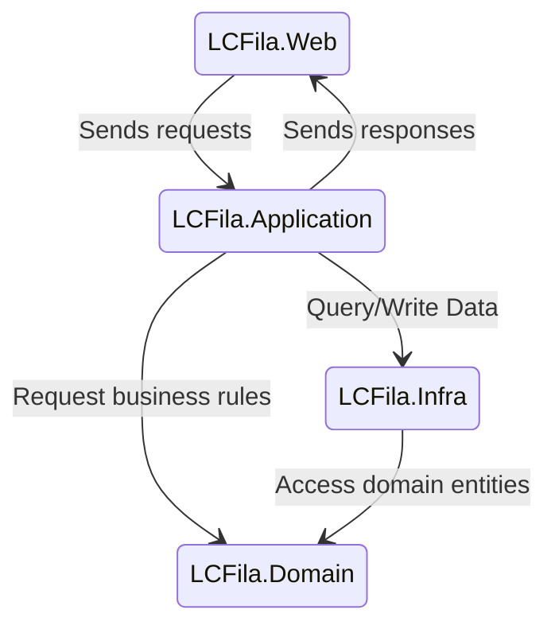

# System Architecture Diagram

## Overview
The system is divided into the following components:

1. **LCFila.Web (Frontend)**:
   - Built using Razor MVC.
   - Handles user interaction and displays queue information.

2. **LCFila.Application**:
   - Contains application logic and services.
   - Processes queue management and priority rules.
  
2. **LCFila.Domain**:
   - Contains business entities and services.
   - Processes business rules.

3. **LCFila.Infra**:
   - Manages data storage and retrieval.
   - Uses Entity Framework Core for database interactions.
   - Manages external calls

## Diagram

