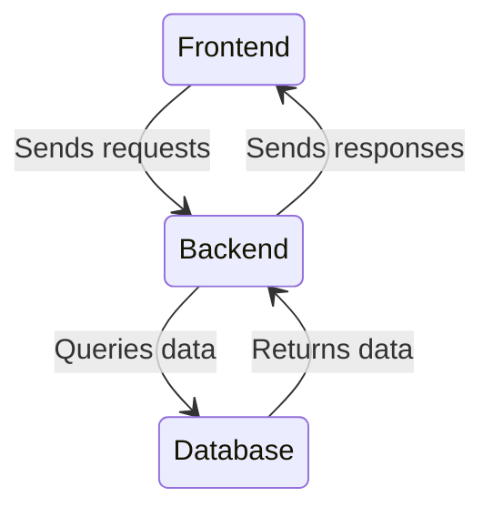

# System Architecture Diagram

## Overview
The system is divided into the following components:

1. **Frontend (LCFila.Web)**:
   - Built using Razor MVC.
   - Handles user interaction and displays queue information.

2. **Backend (LCFila.Application)**:
   - Contains business logic and services.
   - Processes queue management and priority rules.

3. **Database (LCFila.Infra)**:
   - Manages data storage and retrieval.
   - Uses Entity Framework Core for database interactions.

## Diagram

