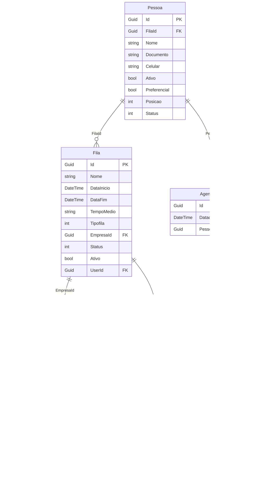

# Database Schema

This diagram represents the database schema for our .NET C# application, based on the provided entity classes. It illustrates the relationships between the tables and their respective columns.

